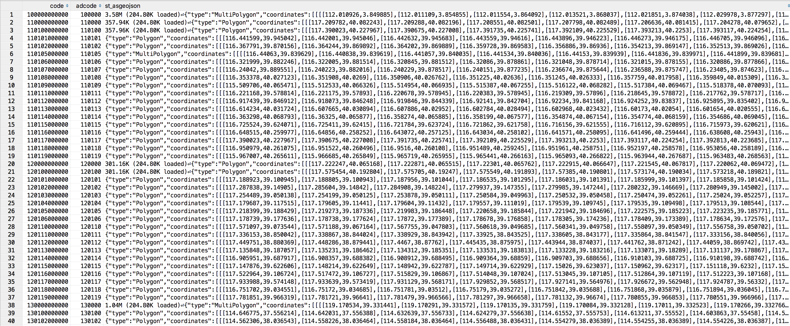

# ADCODE

中国行政区划代码，包括五级行政区划详细代码，县级以上区划地理围栏。

数据来自国家统计局、民政部、高德地图，均为公开数据。


## SYNOPSIS

* 行政区划代码数据基线来自国家统计局：[2016年统计用区划代码和城乡划分代码(截止2016年07月31日)](http://www.stats.gov.cn/tjsj/tjbz/tjyqhdmhcxhfdm/2016/index.html)
* 行政区划变动数据以民政部公告为准：[2017年行政区划代码](http://www.mca.gov.cn/article/sj/tjbz/a/2017/)
* 行政区划地理边界数据来自：[高德地图 行政区划](http://lbs.amap.com/api/webservice/guide/api/district)
* 目前数据时间点为：2016年07月31日，后续会追赶最新变更。
* 核心数据表两张：
  * 行政区划数据表：`adcode`
  * 地理围栏数据表：`fences`
* 数据格式：
  * [行政区划](data/adcode/)是csv格式的数据文件，按所属县级行政区划代码（6位）分片在各自的文件中。
  * [地理围栏](data/fences)是json格式的数据文件，相应县级行政区划代码（6位）的地理围栏以GeoJSON形式存储在单独文件中
  * 使用文本数据格式是为了便于其他应用和数据库使用，但本地实际上使用的是PostgreSQL+PostGIS。[`bin/`](bin/)目录中提供了用于ETL的实用脚本。


## DESCRIPTION

### 行政区划表（adcode）

#### 基础信息

|   表名   |                            adcode                            |
| :------: | :----------------------------------------------------------: |
| 数据目录 |                [`data/adcode/`](data/adcode/)                |
| 控制脚本 |                  [`bin/adcode`](bin/adcode)                  |
| 模式定义 |              [`sql/adcode.ddl`](sql/adcode.ddl)              |
| 数据样例 | 朝阳区行政区划：[data/adcode/110105.csv](data/adcode/110105.csv) |
| 相关知识 | [中国行政区划相关知识](https://vonng.com/blog/admin-division/) |

#### 数据结构

| Column       | Type                  | Description                                             |
| ------------ | --------------------- | ------------------------------------------------------- |
| code         | bigint                | 国家统计局12位行政区划代码                              |
| parent       | bigint                | 12位父级行政区划代码                                    |
| name         | character varying(64) | 行政单位名称                                            |
| level        | character varying(16) | 行政单位级别:国/省/市/县/乡/村                          |
| rank         | integer               | 行政单位级别{0:国,1:省,2:市,3:区/县,4:乡/镇，5:街道/村} |
| adcode       | integer               | 6位县级行政区划代码                                     |
| post_code    | character varying(8)  | 邮政编码                                                |
| area_code    | character varying(4)  | 长途区号                                                |
| ur_code      | character varying(4)  | 3位城乡属性划分代码                                     |
| municipality | boolean               | 是否为直辖行政单位                                      |
| virtual      | boolean               | 是否为虚拟行政单位                                      |
| longitude    | double precision      | 地理中心经度                                            |
| latitude     | double precision      | 地理中心纬度                                            |
| center       | geometry              | 地理中心, `ST_Point`                                    |
| province     | character varying(64) | 省                                                      |
| city         | character varying(64) | 市                                                      |
| county       | character varying(64) | 区/县                                                   |
| town         | character varying(64) | 乡/镇                                                   |
| village      | character varying(64) | 街道/村                                                 |

注意，`center`字段使用了PostGIS扩展。如果你不希望使用PostGIS，修改`center`字段的类型为`TEXT`即可保持兼容，或使用PostgreSQL内建的`Point`类型。

#### 数据样例

```
110105043000	110105000000	东湖街道办事处	town	4	110105	\N	\N	\N	f	f	\N	\N	\N	北京市	市辖区	朝阳区	东湖街道办事处	\N
110105400000	110105000000	首都机场街道办事处	town	4	110105	\N	\N	\N	f	f	\N	\N	\N	北京市	市辖区	朝阳区	首都机场街道办事处	\N
110105035200	110105035000	西会村委会	village	5	110105	\N	\N	111	f	f	\N	\N	\N	北京市	市辖区	朝阳区	管庄地区办事处	西会村委会
110105035201	110105035000	东会村委会	village	5	110105	\N	\N	112	f	f	\N	\N	\N	北京市	市辖区	朝阳区	管庄地区办事处	东会村委会
110105001024	110105001000	南郎家园社区居委会	village	5	110105	\N	\N	111	f	f	\N	\N	\N	北京市	市辖区	朝阳区	建外街道办事处	南郎家园社区居委会
110105001025	110105001000	北郎家园社区居委会	village	5	110105	\N	\N	111	f	f	\N	\N	\N	北京市	市辖区	朝阳区	建外街道办事处	北郎家园社区居委会
```


#### 数据说明

* 原始数据来自国家统计局、民政部、高德地图的公开数据。
* 主键为`code`，国家统计局使用的12位行政区划代码：[编制规则](http://www.stats.gov.cn/tjsj/tjbz/200911/t20091125_8667.html)。
* `adcode`是六位县级行政区划代码，且始终满足`adcode=code/1000000`。
* `level`与`rank`目前为一一对应关系：

| level |   rank   | code | count  |                        name                        |
| :---: | :------: | :--: | :----: | :------------------------------------------------: |
|   0   | country  |  -   |   1    |                         国                         |
|   1   | province | 2位  |   34   |           省、自治区、直辖市、特别行政区           |
|   2   |   city   | 4位  |  344   |              地级市、地区、自治州、盟              |
|   3   |  county  | 6位  |  3133  | 市辖区、县级市、县、自治县、旗、自治旗、特区、林区 |
|   4   |   town   | 9位  | 42868  |        街道、镇、乡、苏木、民族乡、民族苏木        |
|   5   | village  | 12位 | 666655 |                   居委会、村委会                   |

* `post_code`表示的邮政编码目前没有数据，后续补充。
* `area_code`表示的长途区号目前仍需校对。
* `ur_code`是三位城乡划分代码，按标准只有乡、村两级有该属性，但实际中只有村级单位有该属性。
* `municipality`表示该行政区划是否为直辖区划，目前数据不全待补充。
* `virtual`表示该行政区域是否为虚拟区划，目前待补充。
* `latitude, longitude`均为双精度浮点数，原始数据6位有效数字，所有坐标点使用`GCJ-02`火星坐标系。


* `center`表面类型是PostGIS的`GEOMETRY`，底层类型是`ST_Point`，乡村与少量县级区划缺少数据。
* `province, city, county, town, village`是为了使用方便添加的反规范化字段。


* 港澳台市县级数据有待补充，而且需要修正一些坐标系不一致的问题（WGS84 or GCJ-02）。
* 此数据描述为2016年7月时的快照。

#### 实用脚本

数据表有操作管理的便利，文本文件有交流可读的便利。因此提供了实用的ETL工具：[`bin/adcode`](bin/adcode)

大多数功能都要求有一个超级用户权限的PostgreSQL实例，并有一个安装PostGIS扩展的的数据库（非必需）。通过指定环境变量`PGURL`来提供链接参数。默认使用`postgres://localhost:5432/adcode`

```bash
Usage:
	bin/adcode <action>
	
	action list:

	create  :   创建adcode表，若已存在则会删除原表。
	index   :   在adcode表上创建索引（注意，大批量插入时大量索引会严重拖慢插入速度）。
	order   :   排序重建adcode，使其物理有序(rank,code ASC)
	drop	:	删除fences表
	trunc   :   清空adcode表
    clean	:	清空data/adcode中的转储
	dump    :   将adcode表以文本形式转储至data/adcode/，提供adcode列表参数，则只转储对应数据
	load    :   从data/adcode/文本转储导入adcode表，提供adcode列表参数，则只导入对应数据
	backup  :   备份adcode至data/backup/adcode.sql
	resotre :   从备份data/backup/adcode.sql恢复adcode
	check   :   检查adcode数据
	reload  :   清空adcode表，并重新从data/adcode中加载数据
	reset   :   删除并创建adcode表
	setup	:	初始化：建表，加载数据，创建索引。
	usage   :   显示adcode控制脚本用法
```

本地使用时，可以采用`backup/restore`的方式进行备份与恢复，速度会快很多（几秒）。

PR/PULL与发布提交时，再使用`dump/load`生成文本格式的数据（二三十秒）。

此表在平时几乎不会有写入，所以创建了大量索引，可以极大加快查询与转储速度。

但大批量加载时，索引可能会严重拖慢插入速度，您可能需要考虑导入后再重建索引。


### 地理围栏表（fences）

#### 基础信息

| 表名     | fences                                                       |
| -------- | ------------------------------------------------------------ |
| 数据目录 | [`data/fences/`](data/fences/)                               |
| 控制脚本 | [`bin/fences`](bin/fences)                                   |
| 模式定义 | [`sql/fences.ddl`](sql/fences.ddl)                           |
| 数据样例 | 朝阳区地理围栏：[data/fences/110105.json](data/fences/110105.json) |
| 相关知识 | [GCJ-02](https://en.wikipedia.org/wiki/Restrictions_on_geographic_data_in_China#GCJ-02), [PostGIS Geometry](http://workshops.boundlessgeo.com/postgis-intro/geometries.html), [GeoJSON](http://geojson.org) |

#### 数据结构

| Column |   Type   |         Description          |
|--------|----------|------------------------------|
| code   | bigint   | 国家统计局12位行政区划代码|
| adcode | integer  | 6位县级行政区划代码|
| fence  | geometry | 地理围栏,GCJ-02,MultiPolygon|

#### 数据样例

例如，6位县级行政区划代码为820008的澳门特别行政区-圣方济各堂区的[地理围栏](data/fences/820008.json)为

```json
{"type":"Polygon","coordinates":[[[113.601946,22.138113],[113.603872,22.132865],[113.603681,22.132371],[113.597564,22.125115],[113.580194,22.109694],[113.578955,22.10893],[113.576328,22.108147],[113.561046,22.106214],[113.559643,22.106216],[113.553703,22.107469],[113.55353,22.110847],[113.553296,22.116852],[113.553297,22.120642],[113.553574,22.125144],[113.563949,22.127289],[113.563972,22.127298],[113.564018,22.127343],[113.56407,22.127443],[113.564391,22.128297],[113.564475,22.128366],[113.56446,22.128395],[113.564529,22.128445],[113.564552,22.128452],[113.564651,22.128477],[113.564798,22.128486],[113.567266,22.128386],[113.567475,22.128416],[113.56763,22.128485],[113.567778,22.128615],[113.567856,22.128713],[113.56789,22.128884],[113.568003,22.131992],[113.568107,22.132224],[113.568324,22.13235],[113.568618,22.132386],[113.571408,22.132306],[113.572257,22.132331],[113.573184,22.132482],[113.574068,22.132806],[113.574848,22.133293],[113.575827,22.134051],[113.57659,22.134553],[113.577257,22.134854],[113.57802,22.135012],[113.579329,22.135134],[113.580612,22.135239],[113.581375,22.135379],[113.582311,22.135821],[113.583056,22.136473],[113.584062,22.137923],[113.589178,22.14428],[113.601946,22.138113]]]}
```



#### 数据说明

* `fences`表可通过`code`与`adcode`表相连接。
* `fence`使用PostGIS的`GEOMETRY`类型存储，底层类型为`POLYGON`或`MULTIPOLYGON`（带有飞地）
* 大约有300个县没有围栏数据，后续修正。
* 一些虚拟行政区划的地理围栏理论上应当是子行政区的并集，也有待修正。

#### 实用脚本

`bin/fences`用法同`bin/adcode`

```bash
Usage:
	bin/fences <action>
	
	action list:

	create  :   创建fences表，若已存在则会删除原表。
	index   :   在fences表上创建索引（注意，大批量插入时大量索引会严重拖慢插入速度）。
	order   :   排序重建fences，使其物理有序(rank,code ASC)
	drop	:	删除fences表
	trunc   :   清空fences表
	clean	:	清空data/fences中的转储
	dump    :   将fences表以文本形式转储至data/fences/，提供adcode列表参数，则只转储对应数据
	load    :   从data/fences/文本转储导入fences表，提供adcode列表参数，则只导入对应数据
	backup  :   备份fences至data/backup/fences.sql
	resotre :   从备份data/backup/fences.sql恢复fences
	check   :   检查fences数据
	reload  :   清空fences表，并重新从data/fences中加载数据
	reset   :   删除并创建fences表
	setup	:	初始化：建表，加载数据，创建索引。
	usage   :   显示fences控制脚本用法
```

### 其他

在项目顶层目录提供了[makefile](makefile)，可以对两个表同时执行同样的操作。

```bash
make createdb # 创建数据库
make setup	  # 创建、加载、建立索引
```


## ISSUE

* 使用国家统计局最新的2016年07月31日数据，部分区划信息已经过时，待后续补充修正。
* 直辖行政区字段目前仅有省级数据（直辖市），直辖县，直辖镇待后续补充。
* 虚拟行政区字段目前没有实际使用，待后续补充。
* 少部分行政区划地理中心点经纬度坐标数据缺失。
* 地理围栏不是所有行政区划都有，待补充。
* 港澳台地区数据有待补充。
* 邮政编码与长途区号数据有遗漏，待补充


## CONTRIBUTION

本项目欢迎贡献，请以ISSUE的方式指出变更。需要包括：民政部的公告链接，最好能以SQL形式给出变更内容。

PR可以直接在`adcode.csv`与`fences/*.json`中进行变更，能从commit log中清晰看出变更为宜。

请注意，任何合并至master的PR，都需要确保数据一致性，包括：

* 子行政区划的前缀永远与父行政区划保持一致，包括`code, parent`。
* `adcode`表中子行政区的非规范化字段`adcode, province, city, county, town`需要同步修改。
* 需要对`fences`表中进行同步变更，包括`code, adcode`变更，注意围栏的变更有可能导致虚拟父级行政区的围栏变更。
* 任何变更都需要反映在commit log中，包括变更事项，变更时间，引用的公告等。

目前我会在有空时追赶民政部的进度，但这活实在无聊也无趣。


## LICENSE

* WTFPL